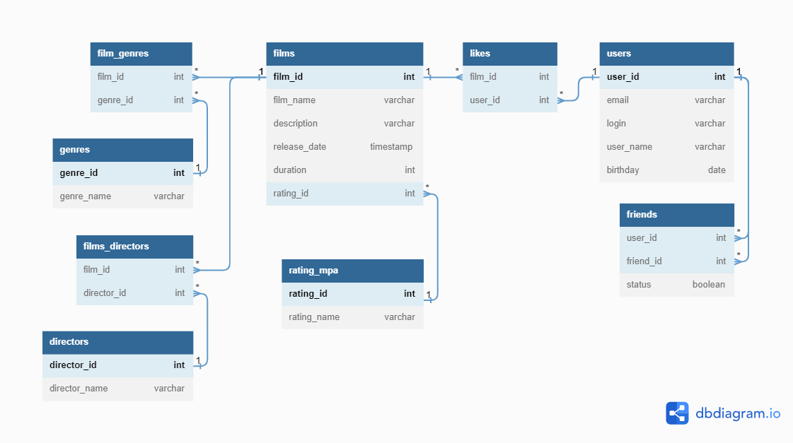

# Filmorate (аналог кинопоиска) - сообщество для оценки и рекомендации фильмов
Стек: Java, Spring Boot, SQL, H2, JdbcTemplate, JUnit.

## О проекте
Монолитное приложение, способное хранить данные в памяти или в базе данных. CRUD и другие запросы к базе данных написаны вручную. Полученные данные обрабатываются с помощью RowMapper.

### Основная функциональность:
- Регистрация и получение пользователей
- Добавление пользователей в список друзей
- Добавление, обновление и удаление фильмов
- Поиск фильмов по названию и режиссёру
- Добавление пользовательских отзывов на фильмы

## Как использовать:
mvn clean package  
docker-compose up -d  

## Спринт №9

 
 Техническое задание 
  
Представьте, что после изучения сложной темы и успешного выполнения всех заданий вы решили отдохнуть и провести вечер за просмотром фильма. Вкусная еда уже готовится, любимый плед уютно свернулся на кресле — а вы всё ещё не выбрали, что же посмотреть!  
Фильмов много — и с каждым годом становится всё больше. Чем их больше, тем больше разных оценок. Чем больше оценок, тем сложнее сделать выбор. Однако не время сдаваться! Вы напишете бэкенд для сервиса, который будет работать с фильмами и оценками пользователей, а также возвращать топ-5 фильмов, рекомендованных к просмотру. Теперь ни вам, ни вашим друзьям не придётся долго размышлять, что посмотреть вечером.  
В этом спринте вы начнёте с малого, но очень важного: создадите каркас Spring Boot приложения Filmorate (от англ. film — «фильм» и rate — «оценивать»). В дальнейшем сервис будет обогащаться новым функционалом и с каждым спринтом становиться лучше благодаря вашим знаниям о Java. Скорее вперёд!  

### Предварительная настройка проекта  
В репозитории создайте ветку controllers-films-users. Разработку решения для первого спринта нужно вести в ней. Репозиторий при этом должен быть публичным.  
Создайте заготовку проекта с помощью Spring Initializr. Некоторые параметры вы найдёте в этой таблице, остальные заполните самостоятельно.  

Параметр Значение  
Group (организация)	ru.yandex.practicum  
Artifact (артефакт)	filmorate  
Name (название проекта)	filmorate  
Dependencies (зависимости)	Spring Web  

Ура! Проект сгенерирован. Теперь можно шаг за шагом реализовать приложение.  

### Модели данных  
Создайте пакет model. Добавьте в него два класса — Film и User. Это классы — модели данных приложения.  
У model.Film должны быть следующие свойства:  
- целочисленный идентификатор — id;
- название — name;
- описание — description;
- дата релиза — releaseDate;
- продолжительность фильма — duration.  

Свойства model.User:  
- целочисленный идентификатор — id;
- электронная почта — email;
- логин пользователя — login;
- имя для отображения — name;
- дата рождения — birthday.  

#### *Подсказка: про аннотацию @Data*  
*Используйте аннотацию @Data библиотеки Lombok — с ней будет меньше работы по созданию сущностей.*  

### Хранение данных  
Сейчас данные можно хранить в памяти приложения — так же, как вы поступили в случае с менеджером задач. Для этого используйте контроллер.  
В следующих спринтах мы расскажем, как правильно хранить данные в долговременном хранилище, чтобы они не зависели от перезапуска приложения.  

### REST-контроллеры  
Создайте два класса-контроллера. FilmController будет обслуживать фильмы, а UserController — пользователей. Убедитесь, что созданные контроллеры соответствуют правилам REST.  
Добавьте в классы-контроллеры эндпоинты с подходящим типом запроса для каждого из случаев.  
Для FilmController:  
- добавление фильма;
- обновление фильма;
- получение всех фильмов.  

Для UserController:  
- создание пользователя;
- обновление пользователя;
- получение списка всех пользователей.  

Эндпоинты для создания и обновления данных должны также вернуть созданную или изменённую сущность.  

#### *Подсказка: про аннотацию @RequestBody*  
*Используйте аннотацию @RequestBody, чтобы создать объект из тела запроса на добавление или обновление сущности.*  

### Валидация  
Проверьте данные, которые приходят в запросе на добавление нового фильма или пользователя. Эти данные должны соответствовать определённым критериям.   
Для Film:  
- название не может быть пустым;
- максимальная длина описания — 200 символов;
- дата релиза — не раньше 28 декабря 1895 года;
- продолжительность фильма должна быть положительной.  

Для User:  
- электронная почта не может быть пустой и должна содержать символ @;
- логин не может быть пустым и содержать пробелы;
- имя для отображения может быть пустым — в таком случае будет использован логин;
- дата рождения не может быть в будущем.  

#### *Подсказка: как обработать ошибки*  
*Для обработки ошибок валидации напишите новое исключение — например, ValidationException.*  

### Логирование  
Добавьте логирование для операций, которые изменяют сущности — добавляют и обновляют их. Также логируйте причины ошибок — например, если валидация не пройдена. Это считается хорошей практикой.  

#### *Подсказка: про логирование сообщений*  
Воспользуйтесь библиотекой slf4j для логирования и объявляйте логер для каждого класса — так будет сразу видно, где в коде выводится та или иная строка.  
*private final static Logger log = LoggerFactory.getLogger(Example.class);*  
Вы также можете применить аннотацию @Slf4j библиотеки Lombok, чтобы не создавать логер вручную.  

### Тестирование  
Добавьте тесты для валидации. Убедитесь, что она работает на граничных условиях.  

#### *Подсказка: на что обратить внимание при тестировании*  
*Проверьте, что валидация не пропускает пустые или неверно заполненные поля. Посмотрите, как контроллер реагирует на пустой запрос.*  

### Проверьте себя  
Так как у вашего API пока нет интерфейса, вы будете взаимодействовать с ним через веб-клиент. Мы подготовили набор тестовых данных — Postman коллекцию. С её помощью вы сможете протестировать ваше API: postman.json  

### Дополнительное задание*  
А теперь необязательное задание для самых смелых! Валидация, которую мы предлагаем реализовать в основном задании, — базовая. Она не покрывает всех возможных ошибок. Например, всё ещё можно создать пользователя с такой электронной почтой: это-неправильный?эмейл@.   
В Java есть инструменты для проверки корректности различных данных. С помощью аннотаций можно задать ограничения, которые будут проверяться автоматически. Для этого добавьте в описание сборки проекта следующую зависимость.  
*<dependency  
<groupId>org.springframework.boot</groupId>  
<artifactId>spring-boot-starter-validation</artifactId>  
</dependency*  

Теперь вы можете применить аннотацию @NotNull к полю класса-модели для проверки на null, @NotBlank — для проверки на пустую строку, @Email — для проверки на соответствие формату электронного адреса. Полный список доступных аннотаций можно найти в документации.  
Чтобы Spring не только преобразовал тело запроса в соответствующий класс, но и проверил корректность переданных данных, вместе с аннотацией @RequestBody нужно использовать аннотацию @Valid.  
*public createUser(@Valid @RequestBody User user)*  

Поздравляем: первый шаг навстречу уютным киновечерам сделан.  
Интересного вам программирования!  

### Коммиты:
#### Коммит №9.1:
feat:  
-Создан пакет model, содержащий файлы классов Model, User, Film;  
-Создан пакет controller, содержащий файлы классов Controller, UserController, FilmController;  
-Создан пакет exception, содержащий файл класса ValidationException;  
-Созданы тесты методов.  

#### Коммит №9.2:
refactor:  
-Переработан класс User;  
-Переработан класс Controller;  
-Переработан класс FilmController;  
-Переработан класс UserController;  
-Переработан класс FilmControllerTest;  
-Переработан класс UserControllerTest;  
-Переработан класс FilmTest;  
-Переработан класс UserTest;  
-Отредактирован файл pom.xml.  

delete:  
-Удалён файл FilmorateApplicationTests.  

#### Коммит №9.3:
refactor:  
-Переработан класс Controller;
-Переработан класс UserController;  
-Переформатирован класс FilmorateApplication;  
-Переработан класс UserControllerTest.  

#### Коммит №9.4:
refactor:  
-Переработан класс Controller.  

## Спринт №10  

 
 Техническое задание 
  
Настало время улучшить Filmorate. Чтобы составлять рейтинг фильмов, нужны отзывы пользователей. А для улучшения рекомендаций по просмотру хорошо бы объединить пользователей в комьюнити.  
По итогам прошлого спринта у вас получилась заготовка приложения. Программа может принимать, обновлять и возвращать пользователей и фильмы. В этот раз улучшим API приложения до соответствия REST, а также изменим архитектуру приложения с помощью внедрения зависимостей.  

### Наводим порядок в репозитории  
Для начала убедитесь в том, что ваша работа за предыдущий спринт слита с главной веткой main. Создайте новую ветку, которая будет называться add-friends-likes. Название ветки важно сохранить, потому что оно влияет на запуск тестов в GitHub.  

#### *Подсказка: про работу в Git*  
*Для слияния веток используйте команду merge.*  

### Архитектура
Начнём с переработки архитектуры. Сейчас вся логика приложения спрятана в контроллерах — изменим это. Вынесите хранение данных о фильмах и пользователях в отдельные классы. Назовём их «хранилищами» (англ. storage) — так будет сразу понятно, что они делают.  
- Создайте интерфейсы FilmStorage и UserStorage, в которых будут определены методы добавления, удаления и модификации объектов.   
- Создайте классы InMemoryFilmStorage и InMemoryUserStorage, имплементирующие новые интерфейсы, и перенесите туда всю логику хранения, обновления и поиска объектов.   
- Добавьте к InMemoryFilmStorage и InMemoryUserStorage аннотацию @Component, чтобы впоследствии пользоваться внедрением зависимостей и передавать хранилища сервисам. 

#### *Подсказка: про структуру проекта*  
*Чтобы объединить хранилища, создайте новый пакет storage. В нём будут только классы и интерфейсы, имеющие отношение к хранению данных. Например, ru.yandex.filmorate.storage.film.FilmStorage.*  

### Новая логика  
Пока у приложения нет никакой бизнес-логики, кроме валидации сущностей. Обеспечим возможность пользователям добавлять друг друга в друзья и ставить фильмам лайки.
- Создайте UserService, который будет отвечать за такие операции с пользователями, как добавление в друзья, удаление из друзей, вывод списка общих друзей. Пока пользователям не надо одобрять заявки в друзья — добавляем сразу. То есть если Лена стала другом Саши, то это значит, что Саша теперь друг Лены.
- Создайте FilmService, который будет отвечать за операции с фильмами, — добавление и удаление лайка, вывод 10 наиболее популярных фильмов по количеству лайков. Пусть пока каждый пользователь может поставить лайк фильму только один раз.
- Добавьте к ним аннотацию @Service — тогда к ним можно будет получить доступ из контроллера.  

#### *Подсказка: ещё про структуру*  
*По аналогии с хранилищами, объедините бизнес-логику в пакет service.*  

#### *Подсказка: про список друзей и лайки*  
*Есть много способов хранить информацию о том, что два пользователя являются друзьями. Например, можно создать свойство friends в классе пользователя, которое будет содержать список его друзей. Вы можете использовать такое решение или придумать своё.  
Для того чтобы обеспечить уникальность значения (мы не можем добавить одного человека в друзья дважды), проще всего использовать для хранения Set<Long> c  id друзей. Таким же образом можно обеспечить условие «один пользователь — один лайк» для оценки фильмов.*

### Зависимости  
Переделайте код в контроллерах, сервисах и хранилищах под использование внедрения зависимостей.
- Используйте аннотации @Service, @Component, @Autowired. Внедряйте зависимости через конструкторы классов.
- Классы-сервисы должны иметь доступ к классам-хранилищам. Убедитесь, что сервисы зависят от интерфейсов классов-хранилищ, а не их реализаций. Таким образом в будущем будет проще добавлять и использовать новые реализации с другим типом хранения данных.
- Сервисы должны быть внедрены в соответствующие контроллеры.

#### *Подсказка: @Service vs @Component*  
*@Component — аннотация, которая определяет класс как управляемый Spring. Такой класс будет добавлен в контекст приложения при сканировании. @Service не отличается по поведению, но обозначает более узкий спектр классов — такие, которые содержат в себе бизнес-логику и, как правило, не хранят состояние.*  

### Полный REST  
Дальше стоит заняться контроллерами и довести API до соответствия REST.
- С помощью аннотации @PathVariable добавьте возможность получать каждый фильм и данные о пользователях по их уникальному идентификатору: GET .../users/{id}.
- Добавьте методы, позволяющие пользователям добавлять друг друга в друзья, получать список общих друзей и лайкать фильмы. Проверьте, что все они работают корректно.
  - PUT /users/{id}/friends/{friendId} — добавление в друзья.
  - DELETE /users/{id}/friends/{friendId} — удаление из друзей.
  - GET /users/{id}/friends — возвращаем список пользователей, являющихся его друзьями.
  - GET /users/{id}/friends/common/{otherId} — список друзей, общих с другим пользователем.
  - PUT /films/{id}/like/{userId} — пользователь ставит лайк фильму.
  - DELETE /films/{id}/like/{userId} — пользователь удаляет лайк.
  - GET /films/popular?count={count} — возвращает список из первых count фильмов по количеству лайков. Если значение параметра count не задано, верните первые 10.
- Убедитесь, что ваше приложение возвращает корректные HTTP-коды.
  - 400 — если ошибка валидации: ValidationException;
  - 404 — для всех ситуаций, если искомый объект не найден;
  - 500 — если возникло исключение.

#### *Подсказка*  
*Настройте ExceptionHandler для централизованной обработки ошибок.*  

### Тестирование  
Убедитесь, что приложение работает, — протестируйте его с помощью Postman: postman.json.   
Ого! Оцените, как Filmorate быстро растёт, — все компоненты занимают свои места, проявляется настоящая бизнес-логика. Любители кино потирают руки. Удачной разработки!  

### Коммиты:
#### Коммит №10.1:
refactor:  
-Переработаны классы Controller, UserController и FilmController;  
-Переработаны классы Film и User;  

feat:  
-Создан класс ErrorHandler;  
-Создан класс NotFoundException;  
-Создан класс ErrorResponse;  
-Создан пакет service с классами AbstractService, FilmService и UserService;  
-Создан пакет с интерфейсами Storage, UserStorage и FilmStorage и классами AbstractStorage, InMemoryFilmStorage и InMemoryUserStorage;  
-Создан пакет utility с классом IdGenerator.  

#### Коммит №10.2:  
refactor:  
-Переработаны классы UserController и FilmController;  
-Переработаны классы AbstractService и UserService;  
-Переработан класс AbstractStorage.

#### Коммит №10.3:
refactor:  
-Переработаны классы UserController и FilmController;  

#### Коммит №10.4:  
refactor:  
-Переработан класс Film;  
-Переработаны классы AbstractService и FilmService;  
-Переработан класс AbstractStorage;  
-Переработан класс FilmControllerTest.  

delete:  
-Удалён пакет util с классом IdGenerator.  

#### Коммит №10.5:
refactor:  
-Переработаны классы Controller, ErrorHandler, FilmController и UserController;  
-Переработаны классы AbstractService, FilmService и UserService;  
-Переработан класс AbstractStorage.  

#### Коммит №10.6:
refactor:  
-Переработаны классы Controller, ErrorHandler, FilmController и UserController;  
-Переработаны классы AbstractService, FilmService и UserService;  
-Переработан класс AbstractStorage.  

## Спринт №11.1 (промежуточное ТЗ)  

 
 Техническое задание 
  

### Задание для взаимопроверки  
Сейчас Filmorate хранит все данные в своей памяти. Это приводит к тому, что при перезапуске приложения его история и настройки сбрасываются. Вряд ли это обрадует пользователей!   
Итак, нам нужно, чтобы данные:  
- были доступны всегда,  
- находились в актуальном состоянии.  

А ещё важно, чтобы пользователи могли получать их быстро. Для этого вся информация должна храниться в базе данных.   
В этом задании вы будете проектировать базу данных для проекта, основываясь на уже существующей функциональности. Вносить какие-либо изменения в код не потребуется.  
Готовое решение отправьте своему партнёру по взаимопроверке из группы.  

*Если ваша работа не пройдёт проверку одногруппником, то ревьюер потратит одну попытку сдачи финального задания следующего спринта на проверку ER диаграммы, и у вас будет меньше попыток сдачи проекта Filmorate.*  

 
 Как проходит взаимопроверка 
  

### Загрузите решение  
Начните с загрузки файла с решением в ваш репозиторий на GitHub. Затем пригласите партнёра по взаимопроверке в приватный репозиторий — сделать это можно через меню Collaboration (англ. «сотрудничество»).  
Откройте настройки репозитория и введите логин партнёра: Settings → Repositories → Manage access → Invite a collaborator. Теперь отправьте ссылку на ваше решение одногруппнику в Пачке.  

*Решение нужно отправить не позднее указанного дедлайна. Когда проверка будет выполнена, не забудьте исключить одногруппника из репозитория — иначе у него останется полный доступ.*  

### Проверьте работу одногруппника  
Вы получили ссылку на репозиторий одногруппника — теперь можно оставлять комментарии к коду. Убедитесь, что код отвечает требованиям задания и code style, принятому в Практикуме.  
Ревью — ответственная задача. Представьте себя на месте другого студента и подумайте, какая обратная связь была бы наиболее полезна для него.  
Идеальный комментарий содержит:  
- Мягкие формулировки. Постарайтесь не использовать слово «нужно» (альтернатива — «лучше») и повелительное наклонение («сделай»). Лучше не перекладывать работу кода на его автора — «этот код делает» вместо «ты делаешь».  
- Развёрнутые объяснения.  
- Обоснование необходимости другого решения.  
- Встречные предложения — как сделать лучше.  
- Поясняющие ссылки на статьи и обсуждения.  

Например: *Здесь лучше использовать вот это — оно реализует такой-то функционал. А то работает медленнее.
[Пример кода. Поясняющая ссылка.]*  

### Оцените обратную связь  
По результатам ревью оцените, насколько полезные комментарии вы получили. Это поможет вашему партнёру быть более конструктивным ревьюером.  
Поделиться своими ощущениями от ревью вы можете в канале #java_neformal.  

### Изучение теории  
Прочтите следующие статьи, чтобы узнать, как проектировать базы данных:  
- «Нормализация баз данных простыми словами»,  
- «Ненормализованная форма или нулевая нормальная форма (UNF) базы данных»,  
- «Первая нормальная форма (1NF) базы данных»,  
- «Вторая нормальная форма (2NF) базы данных»,  
- «Третья нормальная форма (3NF) базы данных».  

Или посмотрите первые 19 минут видео «Нормальные формы баз данных: Объясняем на пальцах» — оно полностью дублирует статьи.  

Если вам захочется бросить себе вызов, советуем прочитать статьи на английском:  
- «What is Normalization in DBMS (SQL)? 1NF, 2NF, 3NF, BCNF Database with Example»,  
- «Normal Forms in DBMS».  

Это поможет набрать словарь технических терминов, который пригодится вам в будущем для чтения документации.  

### Доработка модели  
Прежде чем приступить к созданию схемы базы данных, нужно доработать модель приложения. Сейчас сущности, с которыми работает Filmorate, имеют недостаточно полей, чтобы получилось создать полноценную базу. Исправим это!  

#### Film  
1. Добавьте новое свойство — «жанр». У фильма может быть сразу несколько жанров, а у поля — несколько значений. Например, таких:  
- Комедия.  
- Драма.  
- Мультфильм.  
- Триллер.  
- Документальный.  
- Боевик.  
2. Ещё одно свойство — рейтинг Ассоциации кинокомпаний (англ. Motion Picture Association, сокращённо МРА). Эта оценка определяет возрастное ограничение для фильма. Значения могут быть следующими:  
- G — у фильма нет возрастных ограничений,  
- PG — детям рекомендуется смотреть фильм с родителями,  
- PG-13 — детям до 13 лет просмотр не желателен,  
- R — лицам до 17 лет просматривать фильм можно только в присутствии взрослого,  
- NC-17 — лицам до 18 лет просмотр запрещён.  

#### User 
1. Добавьте статус для связи «дружба» между двумя пользователями:  
2. неподтверждённая — когда один пользователь отправил запрос на добавление другого пользователя в друзья,  
3. подтверждённая — когда второй пользователь согласился на добавление.  

### Создание схемы базы данных  
Начните с таблиц для хранения пользователей и фильмов. При проектировании помните о том, что:  
- Каждый столбец таблицы должен содержать только одно значение. Хранить массивы значений или вложенные записи в столбцах нельзя.  
- Все неключевые атрибуты должны однозначно определяться ключом.  
- Все неключевые атрибуты должны зависеть только от первичного ключа, а не от других неключевых атрибутов.  
- База данных должна поддерживать бизнес-логику, предусмотренную в приложении. Подумайте о том, как будет происходить получение всех фильмов, пользователей. А как — топ N наиболее популярных фильмов. Или список общих друзей с другим пользователем.  

Теперь нарисуйте схему базы данных. Для этого можно использовать любой из следующих инструментов:  
1. dbdiagram.io.  
2. QuickDBD.  
3. Miro.  
4. Lucidchart.  
5. Diagrams.net.  

### Последние штрихи  
Прежде чем отправлять получившуюся схему на проверку:  
1. Скачайте диаграмму в виде картинки и добавьте в репозиторий. Убедитесь, что на изображении чётко виден текст.  
2. Добавьте в файл README.md ссылку на файл диаграммы. Если использовать разметку markdown, то схему будет видно непосредственно в README.md.  
3. Там же напишите небольшое пояснение к схеме: приложите примеры запросов для основных операций вашего приложения.  

#### *Подсказка*  
*Документы по разметке, которая поддерживается GitHub, лежат здесь.*  

Теперь можно отправлять схему на проверку и готовиться проверять работу одногруппника. Вы великолепны!  

  

  

Примеры запросов:  
1. Получение пользователя с ID = 1:  
   SELECT*  
   FROM users  
   WHERE user_id = 1;  
2. Получение фильма с ID = 10:  
   SELECT*  
   FROM films  
   WHERE film_id = 10.  

## Спринт №11

 
 Техническое задание 
  
Ура, практика! Пришло время усовершенствовать Filmorate с помощью полученных знаний о базах данных. На этот раз вы добавите ещё одну функциональность — сохранение состояния данных после перезапуска. Уже к концу задания у вас будет завершённое приложение для работы с фильмами и оценками пользователей. Внимание, мотор!  

### Организация  
В этом спринте вы будете работать в новой ветке. Назовите её add-database. Название ветки важно, потому что к ней привязаны тесты.   

### Создание базы данных  
В уроках спринта вы использовали PostgreSQL — популярную в индустрии базу данных. Однако сейчас вы будете работать с другой базой. Она называется H2. H2 не требует отдельной установки. Её можно встроить в приложение — достаточно добавить зависимость в сборку проекта. Использование встроенной базы данных упростит тестирование вашего приложения в GitHub.   
База будет работать в двух режимах:  
- В режиме тестирования H2 будет хранить данные в памяти. **Это позволит базе быстро запуститься на время тестов и удалить все тестовые данные после их завершения.  
- В рабочем режиме H2 будет хранить данные в файле на жёстком диске. Это не позволит рабочим данным потеряться между запусками.  

Почитайте, как использовать H2 со Spring Boot, в этой статье. Далее следуйте нашей инструкции:  
1. Добавьте в проект зависимости com.h2database.h2, org.springframework.boot.spring-boot-starter-data-jdbc и org.springframework.boot.spring-boot-starter-test.
2. Сконфигурируйте базу данных для рабочего режима с помощью файла настроек application.properties.
*spring.sql.init.mode=always  
'#' в jdbc-url укажите, что данные нужно сохранять в файл  
spring.datasource.url=jdbc:h2:file:./db/filmorate  
spring.datasource.driverClassName=org.h2.Driver  
spring.datasource.username=sa  
spring.datasource.password=password*  
3. Сформируйте структуру базы данных — для этого реализуйте схему, которую вы нарисовали в предыдущем спринте. Обратите внимание: база будет работать, пока работает само приложение. Чтобы подключиться к БД напрямую, используйте встроенный в IntelliJ IDEA функционал или клиент DBeaver.  
4. Не забудьте обновить модели данных в коде — добавьте новые поля.
5. Соберите SQL-запросы, формирующие структуру вашей базы, в отдельный файл в src/main/resources с названием schema.sql — так схема будет создаваться заново при каждом запуске приложения.  

#### *Подсказка: про файл schema.sql*  
*Включите в файл schema.sql создание таблиц. Если вам нужны некоторые данные в базе, их инициализация обычно описывается в файле data.sql — создайте его там же, где и schema.sql.  
Чтобы избежать ошибок, связанных с многократным применением скрипта к БД, добавьте условие IF NOT EXISTS при создании таблиц и индексов.*  

### Работа с DAO  
Таблицы созданы. Теперь можно заняться кодом, который будет отвечать за получение данных из базы.  
1. Вам пригодятся созданные ранее интерфейсы UserStorage и FilmStorage. Напишите для них новую имплементацию — например, UserDbStorage и FilmDbStorage. Эти классы будут DAO — объектами доступа к данным.  
2. Напишите в DAO соответствующие мапперы и методы, позволяющие сохранять пользователей и фильмы в базу данных и получать их из неё.

#### *Подсказка: про аннотацию @Qualifier*  
*Чтобы Spring мог работать с новыми компонентами и отличать их от старых хранилищ, воспользуйтесь аннотацией @Qualifier. Пример её использования можно найти в этой статье.*  

#### *Подсказка: как проверить, что база данных успешно настроена*  
*Убедитесь, что ваше приложение работает с базой данных. Создайте новый фильм и пользователя, а потом перезапустите проект — данные должны сохраниться в базе и быть доступны после перезапуска.*  

#### *Подсказка: как реализовать CRUD-операции с использованием JdbcTemplate*  
*В теме о работе с БД вы узнали, как делать выборку данных из базы с помощью SQL-запросов и JdbcTemplate. Для реализации методов, описанных в интерфейсах хранилищ, вам также потребуется добавлять новые данные и обновлять имеющиеся. Почитайте, как это сделать, в этой статье.*  

### Тестирование  
естировать приложение вручную — трудоёмкий процесс, который сопряжён со многими ограничениями. Использовать Postman-запросы проще, но такой способ не позволяет протестировать имплементацию методов.  
Вам предстоит реализовать интеграционное тестирование (англ. integration testing). С помощью него можно проверить работу приложения с зависимостями — например, с базой данных. Резидентная база данных обеспечит автономность ваших интеграционных тестов — перед каждым их запуском Spring будет создавать новую, чистую БД.  
Подробнее об этом виде тестирования мы расскажем в следующем модуле, но простейшую его реализацию вы выполните уже сейчас.  

@SpringBootTest
@AutoConfigureTestDatabase
@RequiredArgsConstructor(onConstructor_ = @Autowired)
class FilmoRateApplicationTests {
private final UserDbStorage userStorage;

@SpringBootTest
@AutoConfigureTestDatabase
@RequiredArgsConstructor(onConstructor_ = @Autowired)
class FilmoRateApplicationTests {
private final UserDbStorage userStorage;

    @SpringBootTest
    @AutoConfigureTestDatabase
    @RequiredArgsConstructor(onConstructor_ = @Autowired)
    class FilmoRateApplicationTests {
    private final UserDbStorage userStorage;
    
        @Test
        public void testFindUserById() {

            Optional<User> userOptional = userStorage.findUserById(1);

            assertThat(userOptional)
                     .isPresent()
                     .hasValueSatisfying(user ->
                             assertThat(user).hasFieldOrPropertyWithValue("id", 1)
                     );
        }
    } 

### Обратите внимание:  
- по аннотации @AutoConfigureTestDatabase Spring понимает, что перед запуском теста необходимо сконфигурировать тестовую БД вместо основной;
- аннотация @SpringBootTest, которой помечается класс с тестами, говорит о том, что перед запуском этих тестов необходим запуск всего приложения;
- аргумент аннотации @RequiredArgsConstructor указывает, что конструктор, созданный с помощью библиотеки Lombok, сможет получать зависимости через механизм @Autowired.  

Во время инициализации тестовой базы данных Spring прочитает SQL-запросы из стандартного файла schema.sql, который вы собрали в начале задания, и выполнит их для текущей базы данных. Этот скрипт должен создать схему в тестовой БД.  
Теперь можно написать интеграционные тесты для DAO-объектов приложения по примеру выше. С помощью них вы проверите, правильно ли работают ваши запросы к базе данных. Убедитесь, что все публичные методы хранилища покрыты тестами.  

### Доработка бизнес-логики  
Осталось несколько штрихов. Добавьте в код недостающие DAO-объекты, соответствующие вашей схеме, и завершите описание бизнес-логики. После этого протестируйте поведение программы.  
Поскольку в программе появились новые сущности, то нужно обеспечить доступ к ним. Добавьте следующие эндпоинты:  
1. Для получения списка всех жанров и по идентификатору.  
   GET /genres  
   GET /genres/{id}  
   // Пример возвращаемого значения  
   {  
   “id”: 1,  
   “name”: “Комедия”  
   }  
2. Для получения жанра и рейтинга по идентификатору:  
   GET /mpa  
   GET /mpa/{id}  
   // Пример возвращаемого значения  
   {  
   “id”: 1,  
   “name”: “G”  
   }  

При создании и получении фильмов достаточно передать список идентификаторов жанров и идентификатор рейтинга. Эти же данные должны передаваться при обновлении, создании и получении фильмов — если нужно, обновите эти эндпоинты.  
И последнее небольшое изменение: дружба должна стать односторонней. Это значит, что если какой-то пользователь оставил вам заявку в друзья, то он будет в списке ваших друзей, а вы в его — нет.  

#### *Подсказка-напоминание*  
*Не забудьте: у пользователей Filmorate должна быть возможность лайкать фильмы и добавлять друг друга в друзья с подтверждением дружбы.*  

### Финальный кадр  
Убедитесь, что ваше приложение работает правильно. Проверьте его дополнительно с помощью тестов Postman: sprint.json.  

⚠️ Эти же тесты запускаются в GitHub при создании pull request’а. Проверьте их локально, прежде чем делать pull request.  

Поздравляем! У вас получилось полноценное приложение, которое умеет обрабатывать и хранить данные о пользователях и их любимых фильмах. Выбрать что-нибудь для просмотра за ужином больше не составит труда. Вы снова на высоте. Хеппи-энд и титры!  

### Коммиты:
#### Коммит №11.1:  
refactor:  
-полный рефактор всего.  

#### Коммит №11.2:  
refactor:  
-Переработан класс UserDbStorage;  
-Переработан класс UserService;  

feat:  
-Создан класс FilmoRateApplicationTests.  

#### Коммит №11.3:  
refactor:  
-Рефактор после замечаний.  
